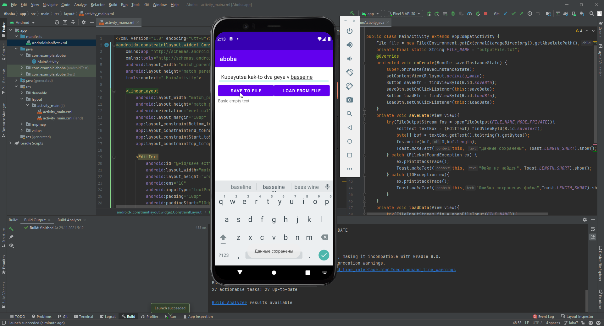
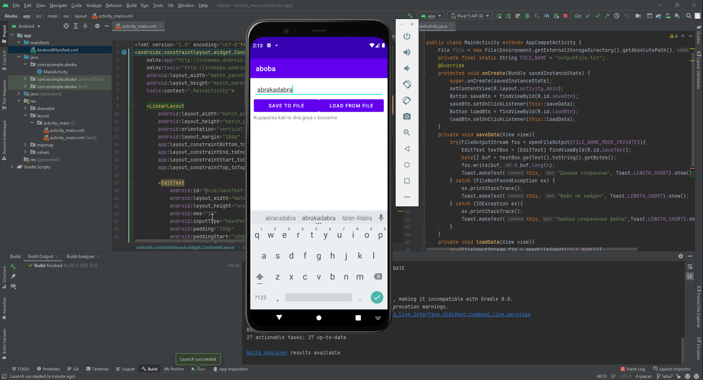

##Савинцев А.С.##  
Задача: разобраться с работой с текстовичками на запись/чтение через андроид студиво (куда они кста сохраняются?))

Пишем код, много гуглим, получаем что-то похожее на результат.

Итого имеем: текстбокс, в который вводится текстик для записи, просто текстик - изначально базовый с рыба-текстом, и две кнопочки, одна нажимается когда в текстбокс введены данные для новой записи и осуществляет непосредственную запись в файлик, вторая считывает данные из этого файлика. Предусмотрены небольшие защиты от косячков через трай кетч.

