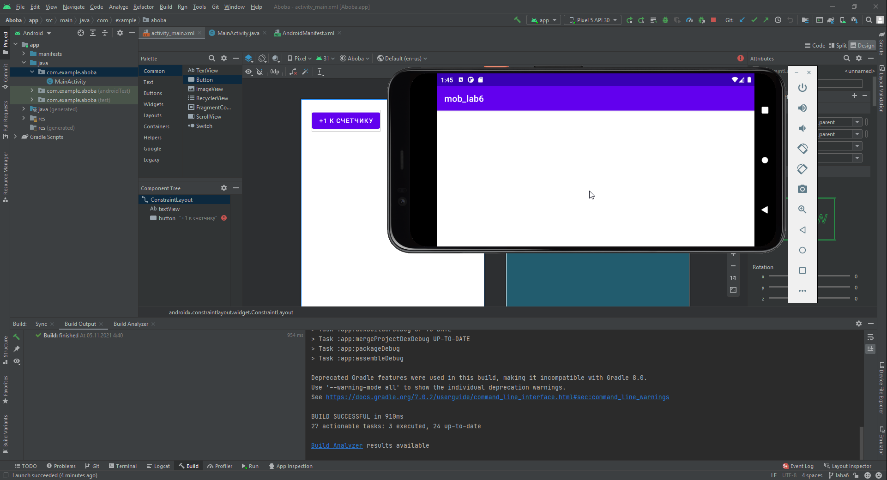
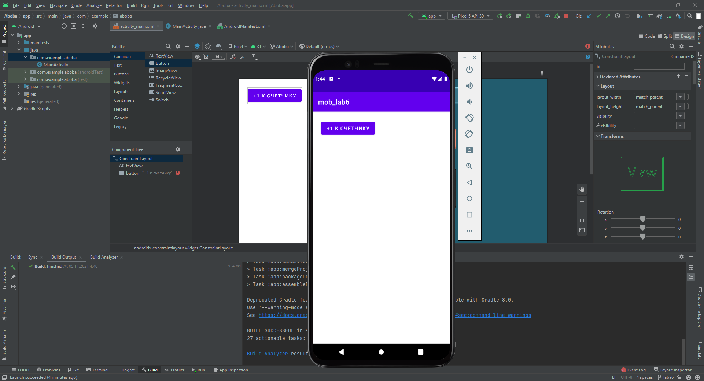

##Савинцев А.С.##  
Вместо описанного в презентации способа возьмем обычный счетчик (его значения тоже сбиваются при переворачивании)
Смотрим как сделано в презентации (функции onSave и onRestore), делаем также, тыкаемся, все получается

По итогу получаем вот такое (не разобрался, как сделать так, чтобы кнопка и текст были на том же месте при перевернутом экране)

