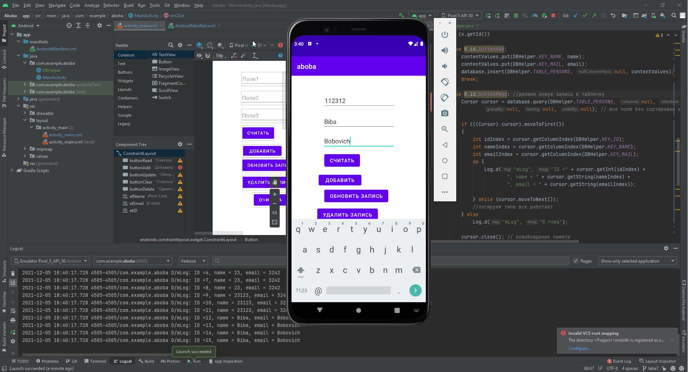

##Савинцев А.С.##  
Задача: подкинуть в приложение БДшечку которая взаимодействует с карточками людей и накидать на нее небольшой интерфейс

Пишем код, много гуглим, получаем что-то похожее на результат.
Там же лутаем DBHelper, используем его в мейнактивити, делаем обычный свитчкейс на нажатие кнопочек, при каждом нажатии делаются разные действия.  

Итого имеем: три текстбоксика, несколько кнопочек на разные виды операций, красивенькие логи в логирующем котике, подобие работы с бд через sql запросики в которые передаются данные текстбокса
