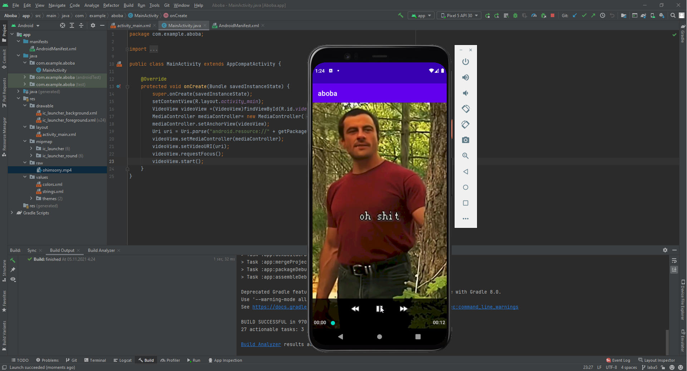

##Савинцев А.С.##  
Берем прошлый проект, убираем все лишнее, теперь работем с видеовью, а не имейджвью. Все связанное с анимациями тоже, подкидываем свой смешной видик.
Смотрим по презентации что и как работает, много тыкаемся и приходим к следующему коду:
```Java
    @Override
    protected void onCreate(Bundle savedInstanceState) {
        super.onCreate(savedInstanceState);
        setContentView(R.layout.activity_main);
        VideoView videoView =(VideoView)findViewById(R.id.videoView);
        MediaController mediaController= new MediaController(this);
        mediaController.setAnchorView(videoView);
        Uri uri = Uri.parse("android.resource://" + getPackageName() + "/" + R.raw.video1);
        videoView.setMediaController(mediaController);
        videoView.setVideoURI(uri);
        videoView.requestFocus();
        videoView.start();
    }
```  
По итогу получаем вот такую красоту
  