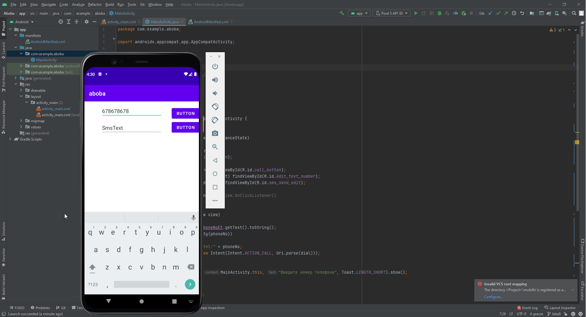
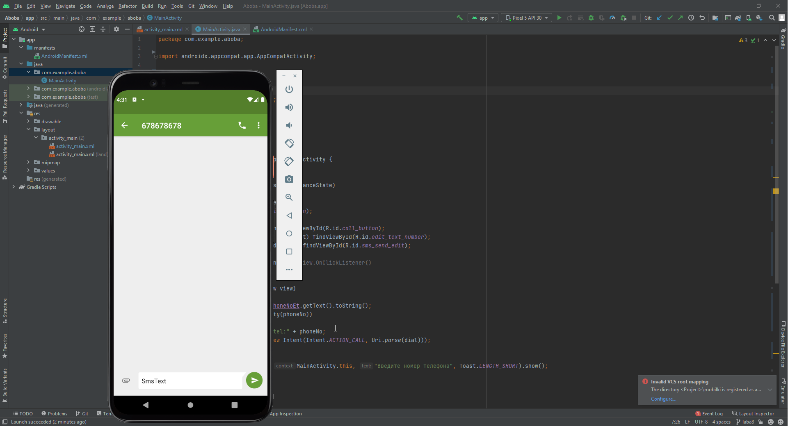

##Савинцев А.С.##  
Задача: разобраться с телефонией

Берем код из презентахи и лабы, смотрим как он устроен и пытаемся интегрировать.

Итого имеем: два текстбокса и две кнопочки, у одной из которых есть листенер в мейнактивити, у второй же просто свойство онклик.

